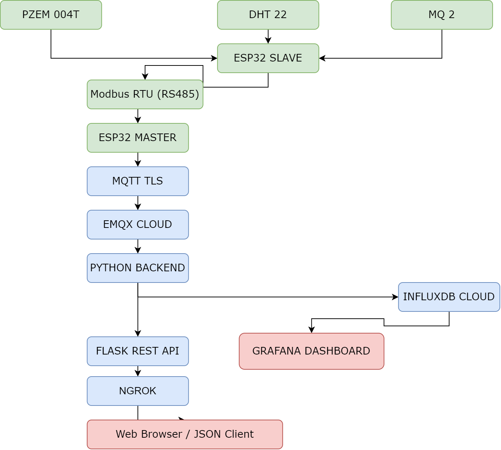
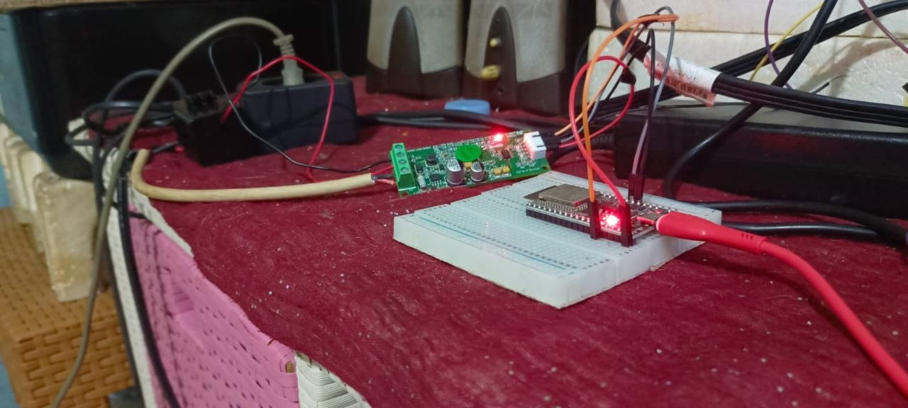
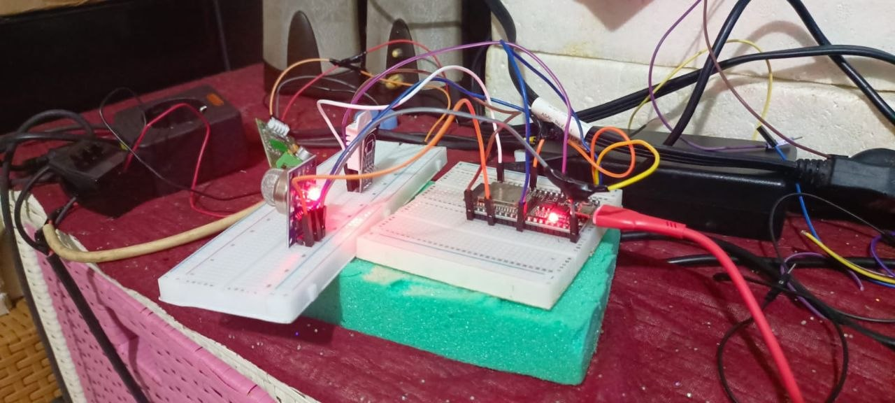
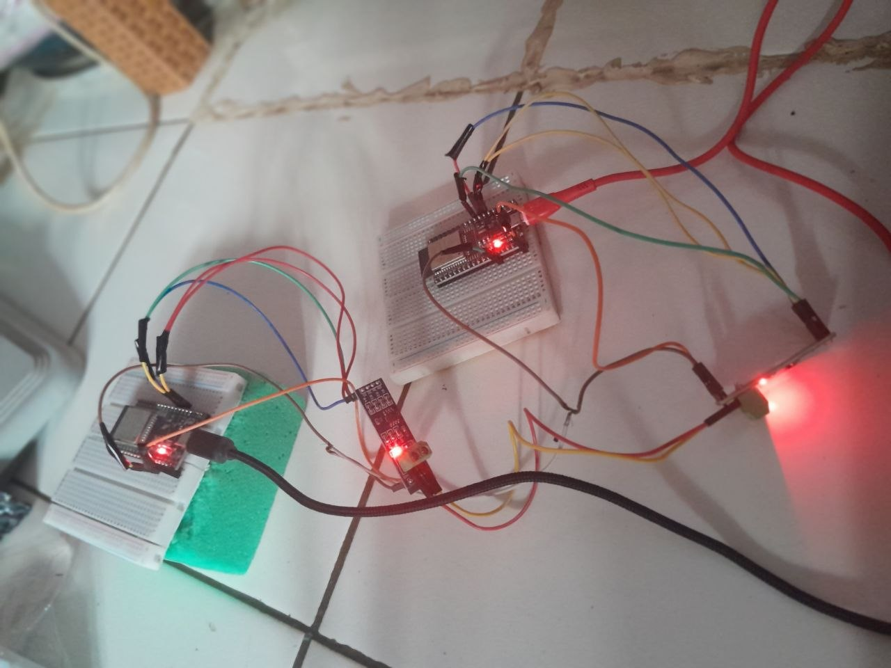
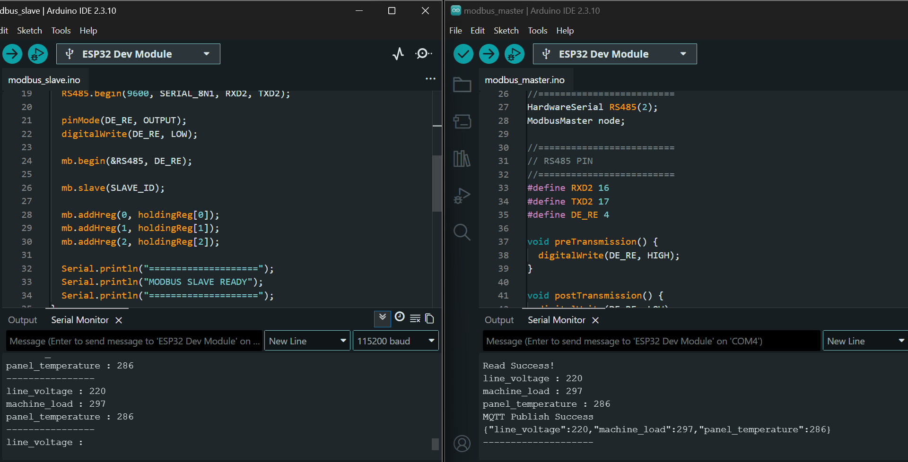
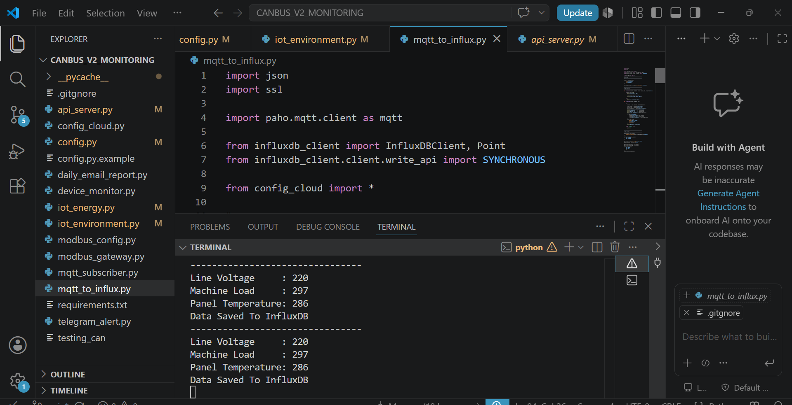
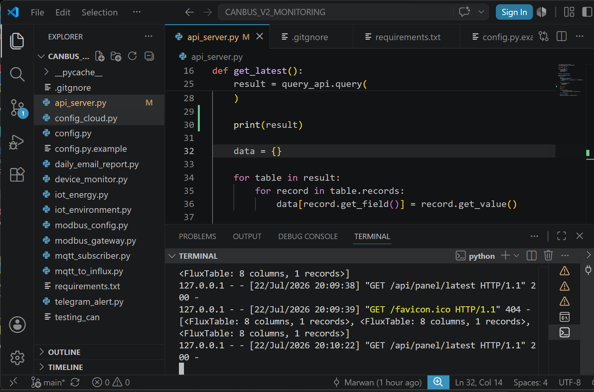
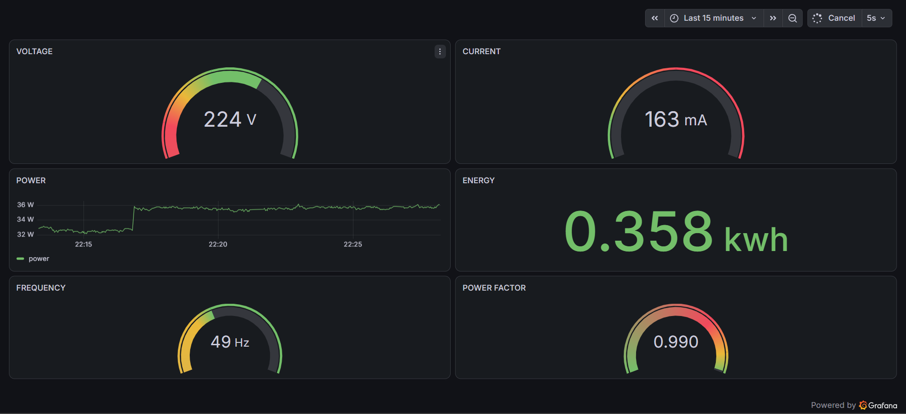
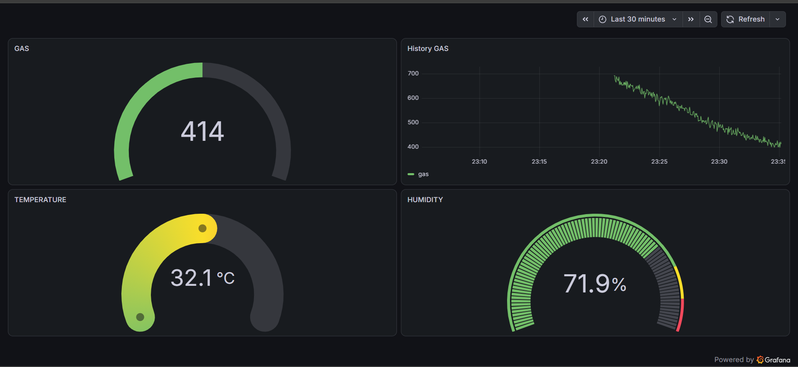
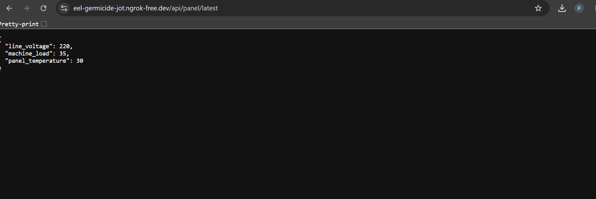

# Industrial Energy Monitoring System

## Project Overview

The Industrial Energy Monitoring System is an Industrial IoT project developed to monitor electrical panel parameters and environmental conditions in real time. The system uses an ESP32 Master–Slave architecture with Modbus RTU (RS485) communication to collect data from multiple sensors, including the PZEM-004T energy meter, DHT22 temperature sensor, and MQ-2 gas sensor.

The ESP32 Master securely publishes sensor data to EMQX Cloud using MQTT TLS. A Python Backend subscribes to the MQTT messages, processes the incoming data, stores it in InfluxDB Cloud, and provides REST API services using Flask. The collected data is visualized through Grafana Dashboard, while ngrok is used to expose the REST API for external access during development and demonstration.

This project demonstrates the integration of embedded systems, industrial communication protocols, cloud services, databases, dashboards, and web APIs in a complete end-to-end Industrial IoT monitoring solution.

## Key Features

- Real-time electrical energy monitoring using PZEM-004T
- Environmental monitoring using DHT22 temperature sensor and MQ-2 gas sensor
- ESP32 Master–Slave architecture with Modbus RTU (RS485) communication
- Secure data transmission using MQTT TLS with EMQX Cloud
- Real-time data processing using Python Backend
- Time-series data storage using InfluxDB Cloud
- Real-time dashboard visualization using Grafana
- REST API development using Flask
- Public REST API access using ngrok for testing and demonstration
- End-to-end Industrial IoT monitoring system integration

## System Architecture

The system consists of two ESP32 devices communicating through Modbus RTU (RS485). The ESP32 Slave collects data from the PZEM-004T energy meter, DHT22 temperature sensor, and MQ-2 gas sensor. The ESP32 Master reads the sensor data via Modbus RTU and securely publishes it to EMQX Cloud using MQTT TLS.

A Python Backend subscribes to the MQTT topics, processes the incoming data, stores it in InfluxDB Cloud, and provides REST API services using Flask. The collected data is visualized on a Grafana Dashboard, while ngrok exposes the REST API for external access during development and demonstration.

## Hardware Components

| Component | Description |
|-----------|-------------|
| ESP32 DevKit V1 (Master) | Reads sensor data from the Slave via Modbus RTU (RS485) and publishes data to EMQX Cloud using MQTT TLS. |
| ESP32 DevKit V1 (Slave) | Collects data from sensors and responds to Modbus RTU requests from the Master. |
| PZEM-004T V3.0 | Measures voltage, current, power, energy, frequency, and power factor. |
| RS485 TTL Module (MAX485) | Enables Modbus RTU communication between the ESP32 Master and Slave. |
| DHT22 | Measures ambient temperature and humidity. |
| MQ-2 Gas Sensor | Detects combustible gas and smoke concentration. |
| Breadboard & Jumper Wires | Used for hardware prototyping and wiring connections. |

### Hardware Setup

#### PZEM-004T Energy Meter

## Project Structure

Industrial-Energy-Monitoring-System/
│
├── ESP32_Master/
├── ESP32_Slave/
├── images/
│
├── api_server.py
├── mqtt_to_influx.py
├── modbus_gateway.py
├── telegram_alert.py
├── requirements.txt
└── README.md

## Software Stack

| Software / Tool | Purpose |
|-----------------|---------|
| Arduino IDE | Develops firmware for the ESP32 Master and Slave. |
| Python | Processes MQTT data, stores data in InfluxDB Cloud, and provides REST API services. |
| EMQX Cloud | MQTT broker for secure data communication using MQTT TLS. |
| InfluxDB Cloud | Stores time-series sensor data. |
| Grafana | Visualizes real-time monitoring data through interactive dashboards. |
| Flask | Develops REST API endpoints for external data access. |
| ngrok | Exposes the local REST API to the internet for testing and demonstration. |
| Postman | Tests and validates REST API endpoints. |
| Git & GitHub | Version control and project documentation. |

### Modbus RTU Communication

The ESP32 Master communicates with the ESP32 Slave using Modbus RTU (RS485). The screenshot below shows both firmware running successfully and exchanging sensor data.

## Python Backend

The Python backend subscribes to MQTT messages, processes sensor data, stores it in InfluxDB Cloud, and provides REST API services.

## Dashboard Preview

### Energy Monitoring Dashboard

The Energy Dashboard visualizes electrical parameters collected from the PZEM-004T sensor, including voltage, current, power, energy consumption, and power factor.

### Facility Monitoring Dashboard

The Facility Dashboard visualizes environmental and equipment monitoring data, including machine load, panel temperature, and gas level in real time.

## REST API

The system provides REST API endpoints using Flask, allowing external applications to access real-time monitoring data. During development and testing, the API is exposed to the internet using ngrok.

### REST API Preview

### Available Features

- Retrieve real-time energy monitoring data
- Retrieve environmental monitoring data
- JSON response format
- Easy integration with web and mobile applications

## Demo Videos

The following videos demonstrate the complete Industrial Energy Monitoring System, including hardware communication, real-time monitoring, dashboard visualization, and REST API functionality.

### Demo 1 – End-to-End System Demonstration

1. Industrial Energy Monitoring System – End-to-End Demonstration

https://drive.google.com/file/d/10rg-_WG38JM3NPomLDMHN5dDMiNJsTe3/view?usp=drivesdk

---

### Demo 2 – Modbus RTU & REST API Demonstration

2. Industrial Energy Monitoring System – Modbus RTU & REST API Demo

https://drive.google.com/file/d/1Nye10JATb9Z6uk4P_x2Sgemz22344_IG/view?usp=drivesdk

## Future Improvements

- Deploy the Python Backend on Ubuntu Linux for 24/7 operation.
- Containerize the application using Docker for easier deployment and scalability.
- Add user authentication for REST API access.
- Support additional industrial sensors using Modbus RTU.
- Develop a responsive web dashboard for remote monitoring.

## Author

Developed by Marwan Saputra as part of a personal learning journey in Industrial IoT, Embedded Systems, and Industrial Automation.

- GitHub: https://github.com/Marwan-git28/industrial-energy-monitoring-system/edit/main/README.md
- LinkedIn: https://linkedin.com/in/username
- Email: projectesp32.mrwn@gmailcom
